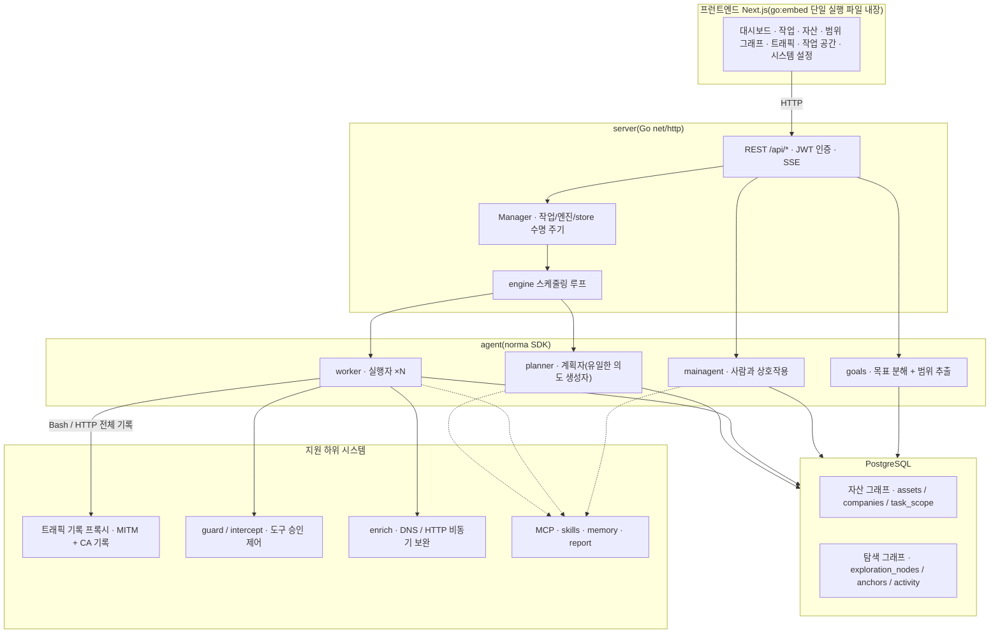
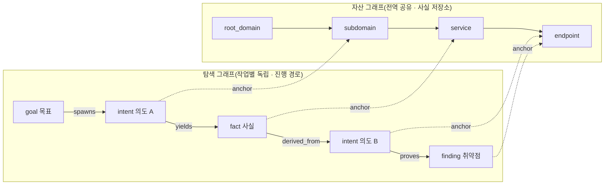
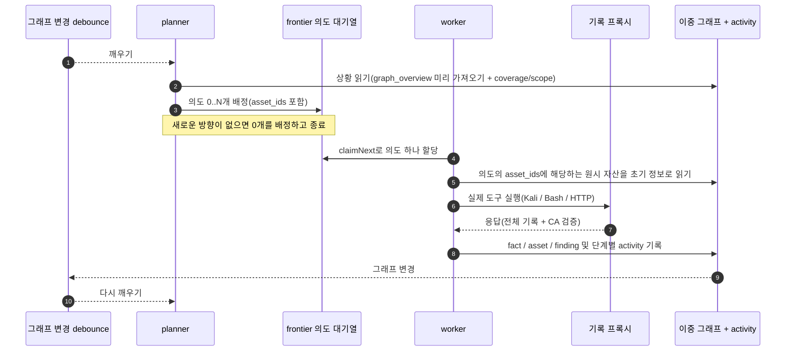
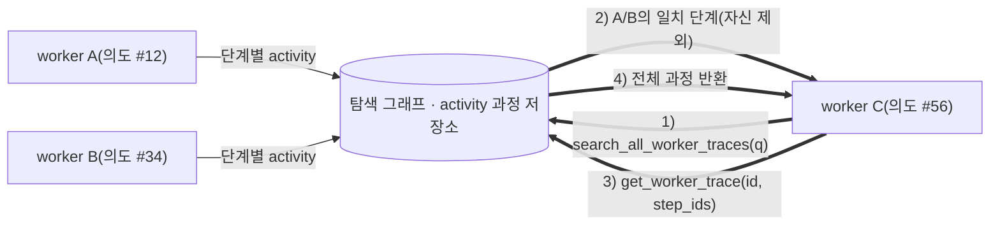
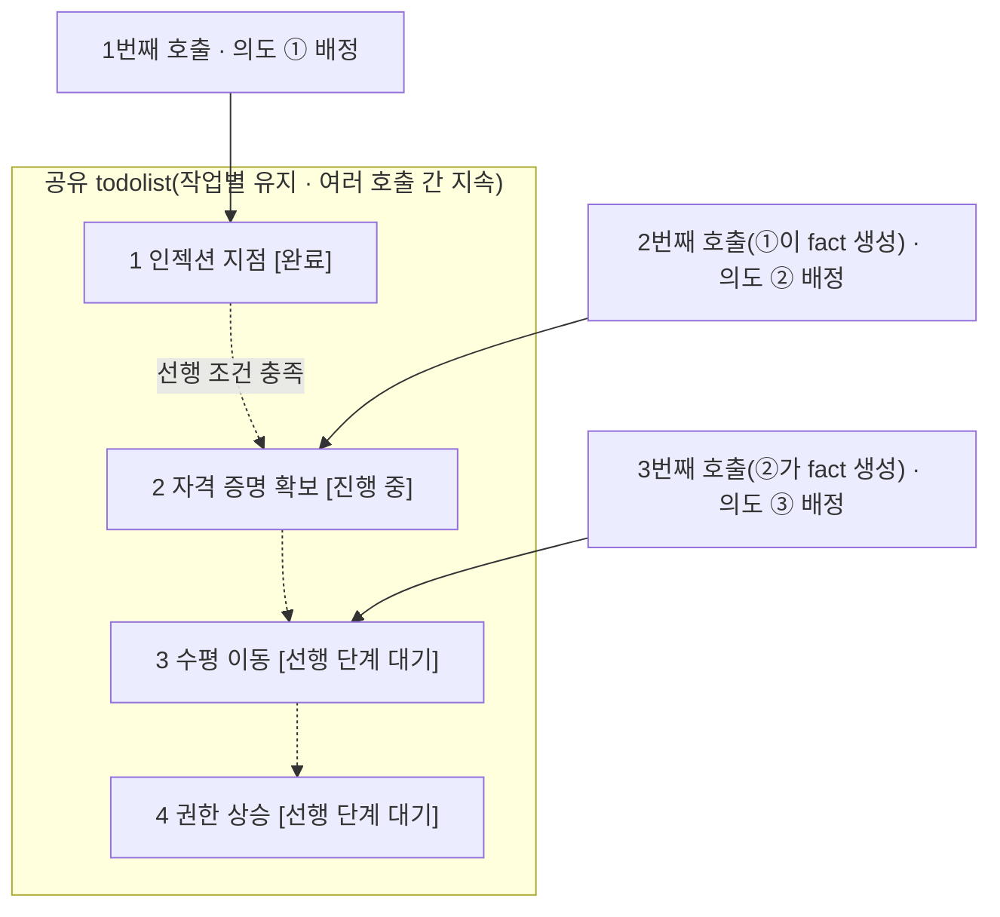

# ARTEX_KR

**ARTEX 한국어판 — AI 자율 침투 테스트 시스템(Go 백엔드 + Next.js 프런트엔드)**

이 저장소는 [Autumn-27/ARTEX](https://github.com/Autumn-27/ARTEX)의 소스 스냅샷을 바탕으로 만든 독립 한국어화 작업 저장소입니다. 원본 Git 커밋 이력은 가져오지 않았으며, 원본 코드·라이선스·저작자 고지는 보존합니다.

- 원본 기준: `b55ceb1fdd84a813d77de09a06af83d323a81f85`(2026-10-04, `main`).
- 원본과 파일 내용이 동일한 최초 반입 커밋: `f99785a`.
- 이 저장소: [machossrc/ARTEX_KR](https://github.com/machossrc/ARTEX_KR).
- **원본 저장소의 버전 확인, 자동/수동 업데이트, 다운로드·교체·롤백 기능을 제거했습니다.** 원본 Docker 이미지를 가져오는 대신 이 저장소의 소스로 직접 빌드합니다.
- 한국어화와 검증을 진행 중입니다. 실제 완료 범위와 검증 결과는 커밋 및 [한국어화 기록](LOCALIZATION.md)을 확인하세요.

> **이 소프트웨어는 개인 학습, 소스 코드 연구 및 직접 구축한 로컬 격리 환경의 기술 검증을 위한 것입니다. 원저작자의 이용 제한과 면책 고지는 이 문서 마지막에 보존되어 있습니다.**

## 화면 미리보기

아래 이미지는 원본 배포본의 참고 화면이며, 한국어화된 실행 화면과 다를 수 있습니다. 원본 온라인 데모는 [artex-demo.vercel.app](https://artex-demo.vercel.app/)에서 확인할 수 있으며 이 저장소의 한국어판 데모가 아닙니다.

| 대시보드(개요 / 토큰 사용량 / 활동 피드) | 작업 목록 |
| :---: | :---: |
|  |  |

| 작업 실행 과정(세션 / 도구 호출) | 탐색 경로 |
| :---: | :---: |
|  |  |

| 발견 사항 | 자산 |
| :---: | :---: |
|  |  |

| 자산 테스트 범위 그래프(힘 기반 배치 · 테스트한 항목 강조 · 노드 접기/펼치기) |
| :---: |
|  |

| 트래픽 기록 | 사람이 참여하는 대화 |
| :---: | :---: |
|  |  |

| 에이전트 관리 | LLM 설정 |
| :---: | :---: |
|  |  |

| 차단 승인 | 백엔드 로그 |
| :---: | :---: |
|  |  |

## 승인 기록 상세 정보

전역 「승인 기록」, 작업 안의 「차단 승인」 및 대화의 승인 카드에서 항목을 펼쳐 상세 정보를 볼 수 있습니다. 표시 구조는 [AegisHook의 승인 상세 컴포넌트](https://github.com/RuoJi6/AegisHook/blob/main/web/src/components/CallDetail.vue)를 참고하며 ARTEX의 컴포넌트와 테마를 사용합니다.

## 자산 동기화(ScopeSentry)

[ScopeSentry](https://github.com/Autumn-27/ScopeSentry)에서 자산 데이터를 직접 동기화하여 중복 수집을 줄일 수 있습니다.

「자산 동기화」 페이지에 ScopeSentry 주소와 API Key를 입력하여 데이터 소스를 연결하세요. 프로젝트 또는 작업 단위로 동기화할 대상과 자산 유형(도메인 / 하위 도메인 / IP / 포트 / 사이트 / 엔드포인트 등)을 선택할 수 있습니다. 가져온 자산은 기업의 자산 범위에 따라 병합되고 ARTEX 자산 그래프에서 에이전트가 사용할 수 있습니다.

## 설치

PostgreSQL이 필요합니다. 에이전트 실행에는 LLM 설정(`ANTHROPIC_API_KEY` 또는 `OPENAI_API_KEY`)도 필요하며 화면에서 입력할 수 있습니다.

### 1. 이 저장소의 소스 받기

```bash
git clone https://github.com/machossrc/ARTEX_KR.git
cd ARTEX_KR
```

이 저장소를 받는 것은 원본 ARTEX 업데이트 기능과 별개입니다. 설치 또는 실행 과정에서 원본의 새 버전이나 배포 파일을 자동으로 받지 않습니다.

### 2. 설치 스크립트(Linux / macOS)

```bash
./install.sh
```

스크립트는 Docker를 확인하고 필요하면 설치 여부를 묻습니다. 이후 다음 두 가지 중 선택합니다.

1. **전체 Docker 실행:** PostgreSQL 비밀번호를 입력합니다(Enter로 무작위 생성 가능). `.env`를 만든 뒤 이 저장소의 한국어판 소스로 이미지를 빌드하고 `docker compose up --build -d`로 실행합니다.
2. **로컬 빌드 실행:** 기존 PostgreSQL에 연결하거나 Docker로 데이터베이스를 실행합니다. `config.json`을 생성하고 프런트엔드를 내장한 Go 실행 파일을 빌드한 뒤 시작합니다.

실행 후 **http://localhost:8787**에 접속하세요. 처음에는 `/setup`에서 관리자 비밀번호를 설정합니다.

### 3. Docker Compose 수동 실행

```bash
cp .env.example .env
# .env의 POSTGRES_PASSWORD를 반드시 변경하세요.
# 필요한 경우 ANTHROPIC_API_KEY 또는 OPENAI_API_KEY도 설정하세요.
docker compose up --build -d
# → http://localhost:8787
```

`artex` 서비스는 `Dockerfile.local`로 로컬 소스를 빌드하며 `artex-ko:local` 이미지를 사용합니다. 원본 `autumn27/artex` 이미지는 사용하지 않습니다. PostgreSQL 및 빌드용 기반 이미지와 패키지는 해당 공급처에서 내려받으므로 완전한 오프라인 설치는 아닙니다.

실행 이미지에는 일반적인 도구(ripgrep/curl/vim/npm/nmap 등)가 포함됩니다. `./skills`와 `./data`는 바인드 마운트로 보존합니다.

원격 MCP는 시스템 설정에서 `http`(Streamable HTTP) 또는 `sse`(이전 SSE 방식)를 선택할 수 있습니다. 이전 SSE 서버는 보통 `GET /sse`로 이벤트 스트림을 열고, 서버가 반환하는 `/message?sessionId=...`로 JSON-RPC 요청을 받습니다. URL에는 `/sse`를 입력하고 필요한 헤더는 `Authorization=Bearer <token>` 형식으로 설정하세요.

### 4. 소스에서 단일 실행 파일 빌드

Go 버전은 `go.mod`의 요구 사항을 따릅니다. 이 스냅샷은 Go 1.26.3을 요구합니다. 프런트엔드는 Node.js와 npm이 필요합니다.

Linux / macOS:

```bash
# 프런트엔드 정적 내보내기
cd web
npm ci
npm run build:static
cd ..

# 내장할 프런트엔드 복사
mkdir -p server/webui
cp -r web/out server/webui/dist

# -tags embedui를 지정해야 프런트엔드가 내장됩니다.
CGO_ENABLED=0 go build -tags embedui -o artex ./cmd/artex
./start.sh
```

Windows PowerShell:

```powershell
Set-Location web
npm.cmd ci
$env:NEXT_EXPORT = '1'
npm.cmd run build
Remove-Item Env:NEXT_EXPORT
Set-Location ..

New-Item -ItemType Directory -Force server\webui | Out-Null
Copy-Item -Recurse -Force web\out server\webui\dist
$env:CGO_ENABLED = '0'
go build -tags embedui -o artex.exe ./cmd/artex
.\start.bat
```

기존 `server/webui/dist`가 있다면 오래된 파일이 섞이지 않도록 빌드 산출물 디렉터리만 먼저 정리하세요. `data/`, `skills/`, 설정 파일 또는 데이터베이스는 삭제하지 마세요.

`start.sh`와 `start.bat`는 현재 실행 파일을 시작하고 인수를 전달할 뿐이며, 다른 버전을 다운로드하거나 교체·롤백하지 않습니다. 직접 `./artex` 또는 `artex.exe`를 실행해도 됩니다. Linux에서 터미널 종료 후에도 실행하려면 다음처럼 시작할 수 있습니다.

```bash
nohup ./start.sh >artex.log 2>&1 &
```

### 5. 교차 플랫폼 배포 압축 파일 만들기

`build.sh`는 프런트엔드를 빌드하고 내장한 다음 Go 링커로 디버그 정보를 제거하여 zip으로 묶습니다. Release 모드는 기본적으로 Linux amd64/arm64, macOS amd64/arm64 및 Windows amd64를 대상으로 합니다.

```bash
./build.sh --release
# dist/ 아래에 플랫폼별 zip 생성
```

UPX 자체 압축 해제 실행 파일은 일부 Linux 커널, 가상화 환경 또는 보안 정책과 호환되지 않을 수 있으므로 기본적으로 사용하지 않습니다. `ARTEX_TARGETS`로 대상을 지정할 수 있으며 대상 환경의 호환성을 확인한 경우에만 `--upx`를 명시적으로 추가하세요.

```bash
ARTEX_TARGETS=linux/amd64,windows/amd64 ./build.sh --release
./build.sh --target linux/amd64 --upx
```

이 독립 저장소에 배포 파일이 게시되기 전에는 원본의 Releases에서 실행 파일을 받아 한국어판을 덮어쓰지 마세요. 로컬 빌드 산출물 또는 이 저장소에서 직접 만든 패키지만 사용하세요.

## 업데이트 기능 제거 및 데이터 보존

이 한국어판에는 원본 저장소를 조회하는 버전 배지, 업데이트 카드, `/api/update/*` 처리기, `selfupdate` 패키지, `update.sh` 및 실행 파일 교체·롤백 경로가 없습니다. Docker Compose도 원본 애플리케이션 이미지를 가져오지 않습니다. 관련 정적 검사는 다음 명령으로 실행할 수 있습니다.

```bash
python tools/check_no_upstream_update.py
```

데이터는 PostgreSQL 볼륨 `pgdata`, `./data`(jwt.key / SQLite 등), `./skills`에 저장됩니다. 실행 파일을 수동으로 다시 빌드하거나 배포하기 전에는 데이터와 데이터베이스를 먼저 백업하세요. 데이터베이스 스키마는 시작할 때 `schema.sql`의 멱등 처리(`ADD COLUMN`, `CREATE INDEX IF NOT EXISTS` 등)로 반영되며, 실행 파일 교체가 데이터베이스 스키마를 이전 버전으로 되돌리는 것은 아닙니다.

## 설정

데이터베이스는 `config.json`에 입력하거나 환경 변수 `ARTEX_PG_DSN`으로 지정합니다.

```json
{
  "database": {
    "host": "127.0.0.1",
    "port": 5432,
    "user": "artex",
    "password": "yourpass",
    "dbname": "artex",
    "sslmode": "disable"
  }
}
```

LLM은 `ANTHROPIC_API_KEY` 또는 `OPENAI_API_KEY` 환경 변수로 설정하거나 화면의 「LLM 설정」 페이지에서 구성할 수 있습니다. 선택 사항으로 `ARTEX_LLM_PROVIDER`, `ARTEX_LLM_MODEL`, `ARTEX_LLM_BASE_URL`, `ARTEX_LLM_PROXY`를 사용할 수 있습니다.

작업별 워커 에이전트 수는 「시스템 설정」에서 구성하며 기본값은 3입니다.

```bash
./start.sh -addr :8787 -proxy :8788
```

`-addr`는 프런트엔드와 API 주소이고 `-proxy`는 트래픽 기록 프록시 주소입니다. 시작 스크립트는 인수를 변경하지 않고 실행 파일에 전달합니다.

### 역방향 프록시 배포(HTTPS / 443만 공개)

프런트엔드와 API/SSE는 같은 백엔드 포트(기본 `:8787`)에서 제공합니다. 실시간 활동 피드는 기본적으로 같은 출처를 사용하므로 `NEXT_PUBLIC_SSE_BASE`를 설정할 필요가 없습니다. 외부에는 443만 공개하고 8787은 내부에 둘 수 있습니다.

SSE는 장기 연결로 데이터를 계속 전달하므로 역방향 프록시의 버퍼링을 꺼야 합니다. 그렇지 않으면 브라우저가 연결되어도 이벤트를 받지 못해 활동 피드가 계속 로딩 상태로 보일 수 있습니다.

```nginx
server {
    listen 443 ssl;
    server_name your.domain.com;
    # ssl_certificate / ssl_certificate_key ...

    location / {
        proxy_pass http://127.0.0.1:8787;
        proxy_set_header Host $host;
        proxy_set_header X-Forwarded-Proto $scheme;

        # SSE: 버퍼링 해제, 긴 시간 제한, HTTP/1.1
        proxy_buffering off;
        proxy_cache off;
        proxy_read_timeout 3600s;
        proxy_http_version 1.1;
        proxy_set_header Connection "";
    }
}
```

SSE가 페이지와 다른 출처(예: 별도 하위 도메인)를 사용해야 하는 경우에만 **빌드 시점**에 `NEXT_PUBLIC_SSE_BASE`를 설정하세요. 이 값은 `next build` 때 정적 파일에 포함되므로 컨테이너 실행 시 바꾸어도 적용되지 않습니다.

## 개발

### 수동 취약점 재검증

작업 상세 정보의 「재검증」 탭에서 해당 작업의 취약점을 페이지별로 선택하고 과거 결론과 증거를 확인하거나 수동으로 재검증을 시작할 수 있습니다. 시작 후 현재 탭을 유지하며 회전 아이콘과 「재검증 중」을 표시합니다. 수정이 확인되면 취약점 상태를 함께 갱신합니다.

취약점 목록의 「재검증」 또는 상세 정보의 「취약점 재검증 → 재검증 요청」을 누르고 필요하면 수정 버전, 테스트 조건 또는 제한 사항을 입력하세요. 별도의 재검증 에이전트 세션을 만들며 현재 페이지는 유지합니다. 전체 목록, 작업별 그룹 및 자산별 보기에서 모두 사용할 수 있습니다. 실행 중인 세션은 「재검증 중」을 눌러 확인하고, 완료하면 다시 「재검증」으로 표시합니다.

원래 스캔 작업을 다시 시작할 필요는 없습니다. 결론은 「여전히 재현 가능」, 「수정됨」, 「확인할 수 없음」으로 구분하며 각 회차의 결론, 증거 및 세션 링크를 취약점 상세 정보에 보존합니다.

백엔드는 최초 시작 시 편집 가능한 「취약점 재검증」(`retester`) 에이전트를 생성합니다. 에이전트 관리에서 프롬프트, LLM, 실행 예산 및 도구를 설정할 수 있습니다. 기본적으로 연결된 LLM을 사용하고 연결된 설정이 없으면 전역 활성 설정을 사용합니다.

세션이 성공적으로 끝나고 결론이 `fixed`이면 취약점 처리 상태를 자동으로 「수정됨」으로 변경합니다. 실행 중, 실패, 중지 또는 그 밖의 결론에서는 원래 상태를 유지합니다. 원래 증거와 보고서는 항상 보존합니다. 상태 선택에서 직접 「수정됨」을 지정할 수도 있습니다. 동일 취약점을 이미 재검증 중이면 기존 세션을 재사용하고, 중지·실패·서버 재시작 후에는 새로 요청할 수 있습니다.

이 스냅샷의 재검증 기록은 상세 정보와 세션에서 확인하며, 취약점 보고서 내보내기나 작업 보관 패키지에는 아직 포함되지 않습니다. 트래픽 패키지도 자동으로 연결하지 않습니다. 데모 모드는 모의 기록임을 명확히 표시하고 실제 대상에는 요청하지 않습니다.

### 로컬 실행 및 테스트

```bash
./dev.sh
# 백엔드 :8787 + 트래픽 프록시 :8788 + next dev :5173
# → http://localhost:5173
```

백엔드는 `go run ./cmd/artex`로 실행합니다. `-tags embedui`가 없으면 프런트엔드는 내장하지 않습니다. 프런트엔드는 `cd web && npm run dev`로 실행하며 `/api`를 백엔드로 프록시하고 변경 내용을 즉시 반영합니다.

```bash
go test ./...
cd web
npx tsc --noEmit
node --test src/lib/activity-merge.test.mjs src/lib/chat-mentions.test.mjs
```

일부 Go 통합 테스트는 실제 PostgreSQL 테스트 데이터베이스와 유효한 `ARTEX_PG_DSN`이 필요합니다. 데이터베이스가 없는 상태에서 일부 테스트가 건너뛰어지거나 실패한 것을 전체 통합 검증 성공으로 해석하지 마세요. Windows에서는 Python 실행 경로 및 경로 구분자와 관련된 테스트 조건도 확인해야 합니다.

백엔드 없는 모의 화면 실행:

```bash
cd web
NEXT_PUBLIC_MOCK=1 npm run dev
```

Windows PowerShell에서는 다음처럼 환경 변수를 먼저 설정합니다.

```powershell
$env:NEXT_PUBLIC_MOCK = '1'
npm.cmd run dev
```

## 시스템 구조

ARTEX는 **LLM 기반 다중 에이전트 자율 침투 테스트 시스템**입니다. Next.js 프런트엔드를 내장한 Go 단일 백엔드와 PostgreSQL로 구성되며, 에이전트 기능은 [`norma`](https://github.com/Autumn-27/norma) SDK의 `agentcore`, `tool`, `permission`, `harness`, `memory`, `transcript`를 사용합니다.

핵심은 **이중 그래프 구조**와 이를 활용하는 두 가지 자율 동작입니다. 워커끼리 실행 과정의 정보를 교환하고, 계획자가 여러 차례에 걸쳐 공유하는 할 일 목록으로 단계적 경로를 유지합니다.

### 전체 계층



| 계층 | 역할 |
| --- | --- |
| 프런트엔드 | Next.js 정적 내보내기를 `go:embed`로 내장. 작업·자산·탐색 경로·테스트 범위 시각화 및 사람과의 대화 |
| server | `net/http` 라우팅, JWT 인증, SSE. `Manager`가 작업·엔진·DB store의 수명 주기 관리 |
| engine | 작업마다 `plannerLoop` 하나와 워커 goroutine N개. 의도 할당, 시간 제한, 일시 중지 및 마무리 대기 |
| agent | goals / planner / worker / mainagent. `ToolSet`이 이중 그래프를 LLM 도구로 제공 |
| db | pgx 기반 PostgreSQL 저장. `go:embed`로 포함한 스키마를 시작할 때 멱등 적용 |
| 지원 기능 | 기록형 MITM 프록시, 승인 제어, 비동기 정보 보완, MCP·스킬·메모리·보고서 |

### 이중 그래프: 탐색 그래프와 자산 그래프

「대상이 무엇인가」와 「어느 정도 테스트했는가」를 독립적인 두 그래프로 분리하고 기준점으로 연결합니다.

**자산 그래프(전역 공유)**는 여러 작업이 함께 사용하는 자산 사실 저장소입니다. `root_domain / subdomain / ip / service / app / endpoint` 노드가 기업에 속합니다. 도메인→하위 도메인→서비스→엔드포인트 관계와 중복 제거 키는 프로그램이 계산하며 에이전트는 원시 정보만 제출합니다.

**탐색 그래프(작업별 독립)**는 한 작업의 판단과 진행 과정을 저장합니다. `goal(목표) / intent(의도) / fact(사실) / finding(취약점) / hint(힌트)`를 `spawns / derived_from / yields / proves` 등의 간선으로 연결하여 어떤 사실에서 어떤 방향이 파생되고 무엇을 산출했는지 나타냅니다.

`exploration_anchors(node_id, asset_id)`는 의도·사실·취약점을 특정 자산과 연결합니다. 탐색 방향에서 대상 자산을 볼 수도 있고 자산에서 그 작업의 테스트 의도와 관찰 사실을 역으로 찾을 수도 있습니다. 자산 테스트 범위 비율과 범위 그래프(범위 내 자산 + 테스트한 항목 강조)도 이 구조를 사용합니다.



계획자는 탐색 그래프의 상황과 목표를 판단하고 미검증된 새로운 방향이 있을 때만 frontier에 의도를 배정합니다. 워커는 의도 하나를 할당받아 실제 도구로 실행하고 새 자산·사실·취약점을 두 그래프에 기록한 뒤 중지합니다. 자산 그래프는 공유 사실이며 탐색 그래프는 작업별 진행 경로입니다.

### 엔진과 의도의 수명 주기

그래프가 바뀌면 계획자를 깨우고, 계획자가 의도를 배정하면 워커가 실행하여 결과를 기록하며, 이 기록이 다시 다음 계획을 유발합니다. 이 이벤트 기반 순환은 `prove_goal`로 목표가 입증될 때까지 이어집니다.



### 워커 간 실행 과정 정보 교환

중요한 오류 메시지, 응답 일부 또는 숨은 매개변수가 워커의 실행 과정에 나타나지만 정식 fact로 기록되지 않을 수 있습니다. 중복 작업을 줄이기 위해 워커는 다른 워커의 실행 과정을 검색할 수 있습니다.

`search_all_worker_traces(q)`는 같은 작업의 다른 워커 실행 과정에서 키워드를 검색합니다. 자신의 의도 단계는 자동으로 제외하며 결과에 `intent_id`를 포함합니다. `list_worker_traces`로 실행 목록을 확인한 뒤 `get_worker_trace(intent_id, step_ids=[…])`로 특정 단계의 전체 내용을 읽을 수 있습니다.

탐색 그래프에 아직 fact가 없어도 다른 워커의 관찰을 재사용할 수 있습니다. 교환 단위는 실행 과정이지만 각 워커는 자신에게 할당된 의도 하나만 수행한다는 경계를 유지합니다.



### 여러 계획에 걸쳐 공유하는 할 일 목록

단계적 경로는 앞 단계의 실제 산출물에 의존합니다. 예를 들어 인젝션 지점 발견→자격 증명 확보→수평 이동→권한 상승을 한 번에 병렬 배정하면 아직 없는 선행 결과를 요구하게 됩니다.

계획자는 작업별로 유지되는 공유 할 일 목록(`todolist`)을 사용합니다. 그래프 변경 때마다 새 세션으로 깨워지더라도 경로를 한 번 기록하고 이후 여러 턴에 걸쳐 의존성 순서대로 배정할 수 있습니다. 매 턴에는 선행 단계가 완료되고 필요한 fact가 존재하는 다음 단계만 배정하며, fact로 충족된 단계는 완료로 표시합니다.



이 구조는 이벤트 기반의 상태 없는 세션에서도 경로를 반복하거나 순서를 뒤섞지 않고 이어 가기 위한 것입니다.

## 원본 프로젝트 커뮤니티

원본 저작자의 WeChat 공식 계정 **SecSentry**를 팔로우한 뒤 개인 메시지를 보내면 원본 프로젝트의 교류 그룹에 참여할 수 있습니다. 이 안내와 QR 이미지는 원저작자 고지를 보존하기 위한 것이며 한국어판의 별도 지원 채널을 뜻하지 않습니다.

<div align="center">

</div>

## 참고

[oritera/Cairn](https://github.com/oritera/Cairn)

## 라이선스 및 면책 고지

### 오픈 소스 라이선스

원본 프로젝트는 **GNU Affero General Public License v3.0(AGPL-3.0)**으로 배포됩니다. 전체 조항은 저장소 루트의 [LICENSE](LICENSE)를 확인하세요. 이 한국어판도 해당 라이선스와 원저작자 고지를 보존합니다. 라이선스 원문 자체를 번역문으로 대체하지 않습니다.

원문의 설명에 따르면 누구나 이 프로젝트를 자유롭게 사용, 수정 및 배포할 수 있으나 파생 저작물도 AGPL-3.0으로 공개해야 합니다. 특히 수정한 프로그램을 네트워크를 통해 사용자에게 제공하는 경우 해당 사용자에게 그 버전의 전체 대응 소스 코드를 제공해야 합니다.

> **중요:** 오픈 소스 라이선스 자체는 사용 목적을 제한하지 않습니다. 다음 이용 제한과 면책 고지는 원저작자가 사용자에게 별도로 제시한 약정 및 선언을 번역하여 보존한 것입니다.

**ARTEX는 개인 학습, 코드 연구 및 로컬 기술 검증에만 사용하며, 어떤 온라인 시스템이나 웹사이트에도 실제 테스트를 수행하는 데 사용해서는 안 됩니다.**

### 허용 범위

프로젝트 소스 코드를 읽고 학습·연구하거나 로컬 격리 환경에서 기술 원리를 검증하는 데만 사용합니다. 개인 학습, 학술 연구, 코드 검토 등 비공격적인 용도를 대상으로 합니다.

### 금지 사항

- 어떠한 웹사이트, 온라인 서비스 또는 네트워크 연결 시스템에도 스캔, 탐지, 악용 또는 공격을 수행하는 것을 엄격히 금지합니다. 승인 여부 및 본인 소유 자산인지 여부와 무관합니다.
- 실제 침투 테스트, 공격·방어 대결 또는 운영 환경에서의 사용을 엄격히 금지합니다.
- 불법 침입, 데이터 절도, 갈취, 서비스 거부 또는 파괴적·범죄적 활동을 엄격히 금지합니다.
- 거주 국가 또는 지역의 법률과 법규를 위반하는 행위를 엄격히 금지합니다.

### 준법 책임

사용자는 거주 국가 또는 지역의 사이버 보안, 데이터 보호 및 컴퓨터 범죄 관련 법률·법규를 직접 준수해야 합니다. 원문의 중국 본토 관련 예시에는 「사이버보안법」, 「데이터보안법」, 「개인정보보호법」 및 관련 사법 해석이 포함됩니다. 이 소프트웨어의 사용으로 발생하는 모든 법적 책임과 결과는 사용자가 부담한다는 것이 원저작자의 고지입니다.

### 면책

이 프로젝트는 「있는 그대로(AS IS)」 제공되며 어떠한 명시적·묵시적 보증도 제공하지 않습니다. 원저작자와 기여자는 사용 방식의 적절성에 관계없이 이 도구의 사용으로 발생하는 직접적·간접적 손실, 데이터 손실, 시스템 손상 또는 법적 분쟁에 책임을 지지 않는다고 고지합니다. 원문의 고지에 따르면 다운로드, 설치 또는 사용은 위 조항을 읽고 이해했으며 동의한 것으로 간주합니다.
