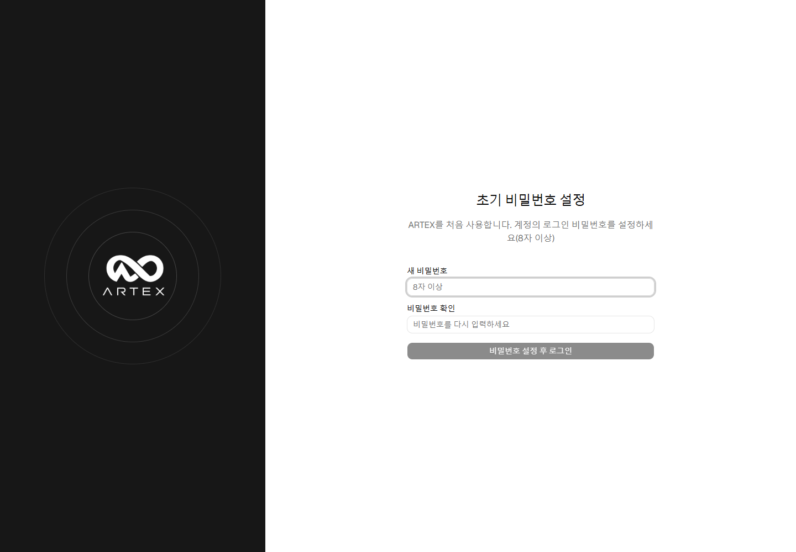
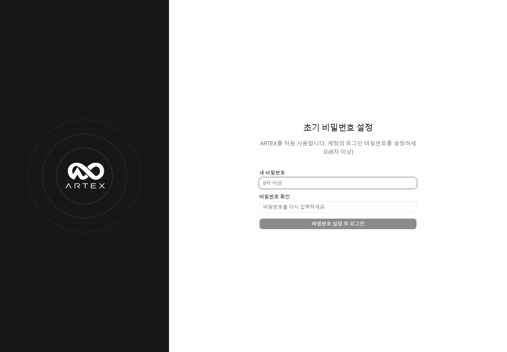
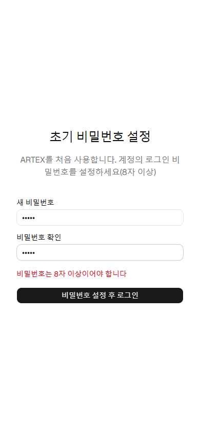

# 2026-10-06 실제 Windows 실행 검증

**전체 상태: 일부 실행 검증 통과 / 도구 안전 검사로 후속 검증 차단. 전체 E2E 완료 아님.**

검증한 소스는 `6d02c2bc9441893541248cbf476b2229e633a68b`입니다. UI 내장 Windows 실행 파일을 새로 빌드하고 기존 사용자 데이터와 분리된 PostgreSQL 테스트 DB·데이터 디렉터리에서 실행했습니다. 서버는 `127.0.0.1:18787`, 기록 프록시는 `127.0.0.1:18788`만 사용했습니다.

## 실제 실행한 검사

| 범위 | 결과와 증거 |
| --- | --- |
| 실행 파일 시작 | `/api/health` HTTP 200, `ok=true`, 버전 `ko-runtime-6d02c2b` |
| 초기 상태 | `/api/auth/status` HTTP 200, `initialized=false` |
| 보호 API 3개 | 인증 없는 `/api/tasks`, `/api/agents`, `/api/skills`가 401과 `권한 없음` 반환 |
| Chrome 154.0.8037.97 | 1440×1000 / 390×844에서 한국어 초기 화면과 입력 오류 표시 통과 |
| Edge 154.0.4258.53 | 같은 두 화면 크기에서 동일 검사 통과 |
| 입력 검증 | 빈 입력 시 버튼 비활성화, 불일치·8자 미만 입력의 한국어 오류. 서버 쓰기 요청 0건 |
| 라우트 보호 | 브라우저별 14개 경로가 초기 설정 화면으로 이동. 로그인 후 본문 검증과는 다름 |
| 화면 안정성 | 네 브라우저·화면 크기 조합의 가로 넘침 없음, 수집한 JavaScript pageerror 0건 |
| 실제 HTTP 프록시 | 별도 로컬 HTTP 서버의 한국어 45바이트 및 대형 558,000바이트 응답이 원본과 바이트 단위 일치 |
| 저장 | 소형 본문 인라인 저장·대형 본문 blob 저장, 두 기록의 길이·SHA-256 원본 일치 |
| 강제 종료 후 재시작 | 같은 실행 파일·DB·데이터 디렉터리로 재실행 후 health 정상, 두 기록·해시 유지, SQLite quick_check=ok |
| 종료 정리 | 테스트 앱·프록시·HTTP 대상·테스트 PostgreSQL 종료. 18787/18788/18889/55439 포트 닫힘 확인 |

## 실행하지 못한 검사

초기 설정을 저장하고 로그인하는 브라우저 요청과 외부 공급자 연결 요청이 OpenAI의 도구 안전 검사에서 차단되었습니다. 따라서 **로그인 이후 작업·자산·보고서의 생성/편집/내보내기, 실제 LLM 호출, 번역 전후 모델 행동 동등성은 확인하지 못했습니다.** 차단된 요청을 다른 인증 경로나 모의 응답으로 대체하지 않았습니다. PostgreSQL의 저장 프롬프트 내용 대조 요청도 차단되어 미검증입니다. Linux/macOS 실행 검증도 하지 않았습니다.

`browser-runtime.json`의 `status: pass`는 파일에 명시한 **비로그인 초기 화면·입력 오류·경로 보호 검사만**의 통과이며, 전체 작업 완료를 뜻하지 않습니다. 전체 상태는 상위 `verification.json`의 `partial_blocked`입니다.

## 실제 화면

### Chrome 데스크톱

### Chrome 모바일 입력 검증

### Edge 데스크톱

### Edge 모바일 입력 검증

## 재현 코드와 기록

`tools/check_runtime_readonly.mjs`는 초기화되지 않은 로컬 테스트 인스턴스에만 적용하는 브라우저 검사입니다. 정상 비밀번호 저장이나 로그인은 수행하지 않으며 API 쓰기 요청이 발생하면 차단하고 실패로 처리합니다. Playwright 모듈은 저장소 밖 테스트 도구 디렉터리에 설치했습니다.

세부 결과: `browser-runtime.json`, `proxy-runtime-result.json`, `persistence-before-restart.json`, `restart-result.json`, `cleanup-result.json`. 원문 로그·테스트 DB 연결 설정·임시 키는 저장소에 넣지 않았습니다.
