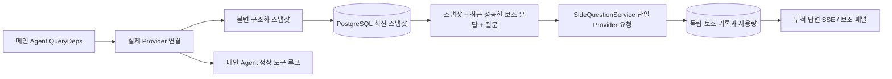

# ARTEX `/btw`

일반 대화, 작업 MainAgent 및 현재 작업의 자체 Worker는 독립적인 보조 질문을 지원합니다. 메인 입력창에 `/btw 질문`을 입력하면 제출하고, 내용 없는 `/btw` 또는 「보조 질문」 버튼으로 기록을 엽니다. 데스크톱에서는 너비 조절이 가능한 사이드바, 모바일에서는 Drawer를 사용합니다.

보조 답변은 제출 시점의 에이전트 컨텍스트 스냅샷을 기반으로 생성되며 스트리밍 표시, 후속 질문, 중지 및 초기화를 지원합니다. 패널 닫기, 페이지 새로 고침 또는 SSE 연결 해제는 모델 요청을 취소하지 않습니다. 중지는 현재 보조 질문에만 영향을 줍니다. 초기화는 보조 질문을 취소하고 기록을 삭제하지만 메인 컨텍스트 스냅샷은 보존합니다.

## 구현 범위

원래 구현은 Go, norma v0.3.7, Next.js와 기존 Markdown / ResizablePanel / Drawer / AlertDialog 컴포넌트를 사용했으며 norma 소스를 수정하거나 보조 질문용 의존성을 추가하지 않았습니다. Planner, 다른 작업에서 상속한 Worker 및 도구형 하위 작업 업그레이드는 해당 구현 범위에 포함되지 않습니다. 이 문서의 구현 당시 버전과 현재 저장소의 의존성 버전은 구분합니다.

- `capture.go`는 `Options.Deps.CallModel / CallModelSync`에서만 메인 루프 요청을 표시합니다. Provider 장식자는 구체적인 모델 내부, 라우팅 풀의 바깥쪽 선택 이후에 있으므로 실제 선택한 모델을 기록합니다. 압축·요약 요청은 스냅샷을 덮어쓰지 않습니다.
- 요청 시작, 완전한 모델 응답 및 실행 최종 상태에서 스냅샷을 게시합니다. 생성 중인 부분 응답은 게시하지 않습니다. norma의 `MessagesForAPI`로 도구 호출과 결과의 쌍을 유지하며 결과는 다음 메인 모델 요청 또는 실행 최종 상태에서 스냅샷에 들어갑니다. 스트리밍 중단 시 이전 유효 경계를 보존합니다.
- JSON 깊은 복사로 구조화 메시지, 시스템 프롬프트, 도구 정의 및 생성 매개변수를 보존합니다. 모델 추론 중 스냅샷 잠금이나 DB 트랜잭션을 유지하지 않습니다.
- `SideQuestionService`는 구체적인 Provider를 호출합니다. 필요하면 먼저 보조 요약을 생성하고, 최종 답변은 첫 컨텍스트 초과 오류에서 아직 텍스트·도구 호출이 출력되지 않은 경우에만 축소 후 한 번 재시도합니다. agent session을 생성하지 않고 도구 실행기, 메인 transcript, 활동 스트림, 작업 그래프 및 작업 모델 전환 체인에 연결하지 않습니다. 기존 구조화 도구 컨텍스트와의 호환성을 위해 답변 요청에는 도구 정의를 보존하지만 요약 요청에는 제공하지 않습니다. 새로 반환된 도구 호출에는 실행 경로가 없습니다.
- 부모 세션마다 실행 요청 하나, 서비스 프로세스마다 최대 네 개, 요청당 제한 시간 120초입니다. 보조 질문은 서비스 수명 주기에 속한 독립 취소 컨텍스트를 사용합니다.
- 보조 요청은 모델 설정 참조와 민감하지 않은 식별 요약을 보존하며 요청 시 기존 설정에서 자격 증명을 얻습니다. 설정이 삭제되거나 모델·프로토콜·주소 등의 식별 필드가 변경되면 먼저 메인 에이전트를 실행하여 스냅샷을 갱신해야 합니다. 테스트는 제품 기본 모델을 바꾸지 않습니다.

## 영구 저장과 복구

`db/schema.sql`이 `side_question_sessions`와 `side_question_requests`를 자동 생성합니다. 전자는 부모 자원, 최신 스냅샷, 실행 번호, 버전 및 정리 버전을 저장하고 후자는 질문, 누적 답변, 상태, 모델, 스냅샷 시각, 사용량, 이벤트 순번 및 페이지 순번을 저장합니다.

부모 세션 키에는 conversation ID 또는 task ID + exploration ID + intent ID를 사용합니다. Worker는 재사용 가능한 실행 슬롯 이름을 쓰지 않습니다.

스냅샷을 부모 세션별로 합쳐 250ms마다 기록하고 DB에서 `(run_id, version)`을 비교하여 이전 버전이 덮어쓰지 못하게 합니다. 보조 질문 제출 전에 선택한 스냅샷을 다시 저장합니다. 저장에 성공하면 메모리의 큰 스냅샷을 해제하고 실패하면 기록할 버전을 보존합니다. 스트리밍 이벤트의 누적 답변은 최대 250ms에 한 번 기록하고 최종 상태는 즉시 저장하며 DB 오류에는 제한된 횟수로 재시도합니다.

서비스 시작 시 남아 있는 `running` 요청을 `interrupted`로 표시합니다. 저장된 부분 답변·사용량은 보존하고 요청을 자동 재실행하지 않습니다. 최근 성공적으로 저장한 컨텍스트로 바로 다음 질문을 할 수 있습니다. 이전 세션에 스냅샷이 없으면 먼저 메인 에이전트를 실행해야 하며 UI 활동 기록으로 컨텍스트를 재구성하지 않습니다.

초기화는 정리 버전을 증가시키고 요청을 삭제합니다. 조건부 갱신으로 늦게 도착한 콜백의 재기록을 차단합니다. 부모 자원의 물리 삭제는 외래 키 연쇄 삭제를 사용합니다. Worker의 논리 삭제는 같은 트랜잭션에서 보조 데이터를 삭제하고 뒤늦은 스냅샷도 거부합니다. 작업 보관은 새 요청 차단, 메인 흐름 중지 대기, 보조 질문 취소 및 저장 완료 대기 순서로 처리합니다. 보관 형식은 v3이며 보조 테이블이 없는 v1/v2와도 호환됩니다.

기록은 전체 보존하며 순번 커서로 페이지당 최대 20건을 반환합니다. 모델 요청에는 최근 성공한 문답 원문 최대 20쌍을 토큰 예산 안에서 재생하고, 오래된 문답은 독립적인 누적 요약으로 관리합니다. 메인 컨텍스트가 예산을 넘으면 보조 사본의 오래된 부분만 요약하고 최근 구조화 도구 호출·결과를 유지합니다. 요약, 준비 진행률 및 사용량에도 같은 동시 실행·취소·120초 제한을 적용합니다. 자세한 내용은 [컨텍스트 예산과 오픈 소스 참고](CONTEXT_BUDGET.md)를 참조하세요.

## HTTP 계약

다음 경로를 `{parent}`로 사용하며 기존 인증·자원 검사를 유지합니다.

- `/api/conversations/{id}`
- `/api/tasks/{id}/chat`
- `/api/tasks/{id}/intents/{iid}`

| 요청 | 반환과 동작 |
| --- | --- |
| `GET {parent}/side-questions?before={ordinal}` | 최신순 `items`, 독립적인 `current` 실행 상태, `snapshot` 메타정보, `next_cursor`; 커서 0은 최신 페이지 / 다음 페이지 없음 |
| `POST {parent}/side-questions` | JSON `{ "question": "…", "client_request_id": "UUID" }`; 새 요청은 202와 요청 객체, 같은 ID·질문은 기존 객체와 200 반환 |
| `DELETE {parent}/side-questions` | 현재 부모 세션의 보조 문답 취소·초기화 |
| `GET /api/side-questions/{requestID}/events` | `snapshot` SSE 이벤트, `id`는 증가하는 순번, `data`는 전체 누적 요청 객체; 초기화 시 `cleared` 전송 |
| `POST /api/side-questions/{requestID}/cancel` | 명시적 취소. 기록 또는 SSE에서 최종 상태 확인 |

질문은 최대 4000자입니다. 스냅샷 없음, 모델 설정 변경, 같은 부모 세션의 처리 중 상태 또는 멱등 ID 충돌은 409, 전역 동시 실행 한도는 429를 반환합니다. SSE 연결마다 이전에 받은 텍스트 조각에 의존하지 않고 누적 상태를 먼저 보냅니다. 프런트엔드는 요청 ID + 순번으로 병합하며 부모 세션 전환·초기화 시 이전 콜백을 폐기합니다.

## 검증과 참고

원래 구현 당시의 자동화 검사, 실제 모델 사용 및 알려진 한계는 [VALIDATION.md](VALIDATION.md)에 있습니다. 해당 기록은 이번 한국어화에서 새로 실행한 검증과 다릅니다.

독립 요청은 [Grok CLI side-question.ts(고정 커밋)](https://github.com/superagent-ai/grok-cli/blob/fb97af83f06dca873281d60168430f06c8de6324/src/utils/side-question.ts), 실행 격리는 [OpenCode(고정 커밋)](https://github.com/anomalyco/opencode/tree/b3f1a96c6dd7adeb28b36dd11add1998fc84d67b)를 참고했습니다. ARTEX는 norma의 구조화 메시지를 사용하며 프런트엔드 로그에서 텍스트를 이어 붙이는 방식을 쓰지 않았습니다.
